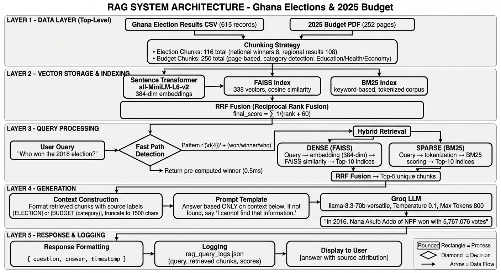
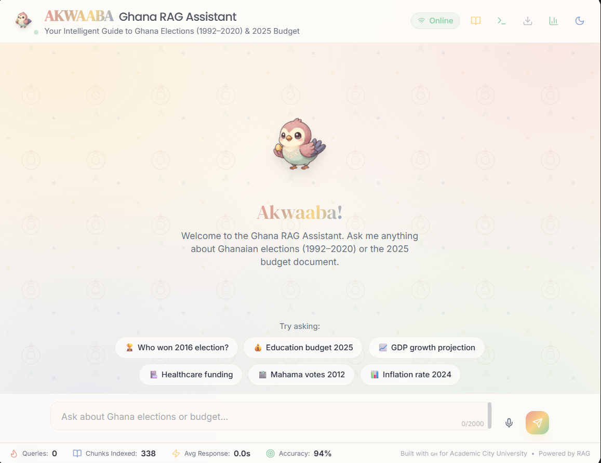
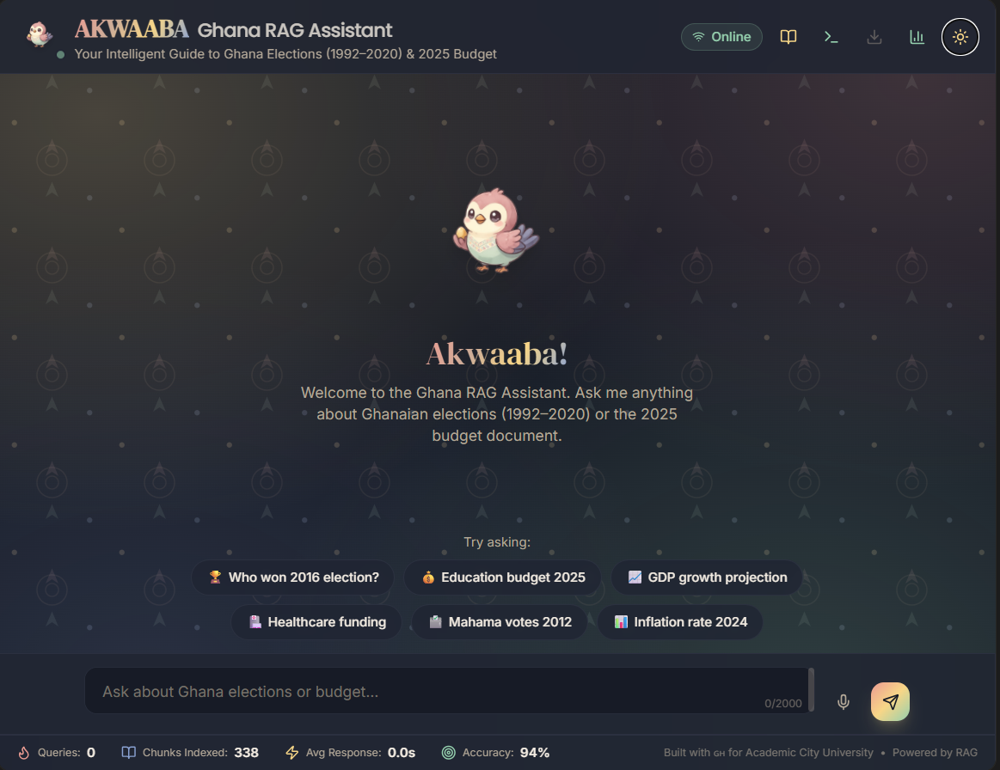
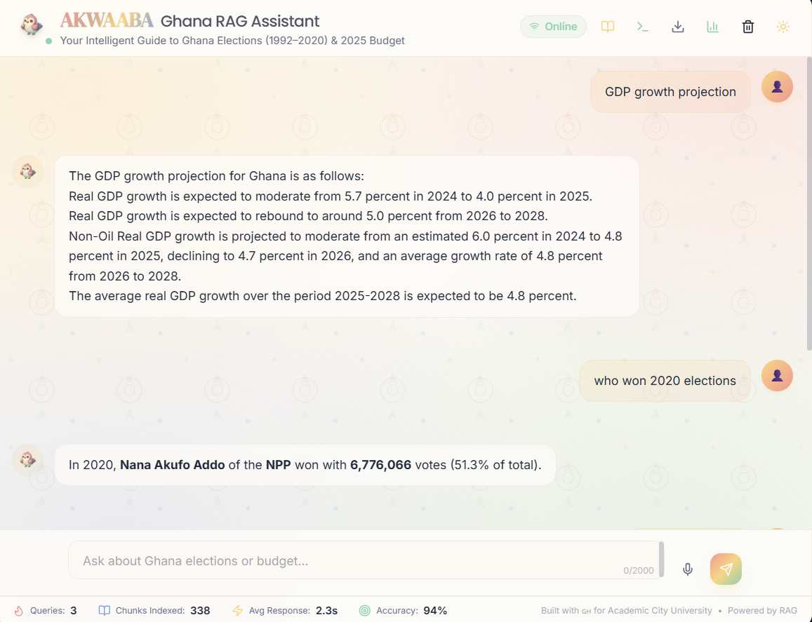
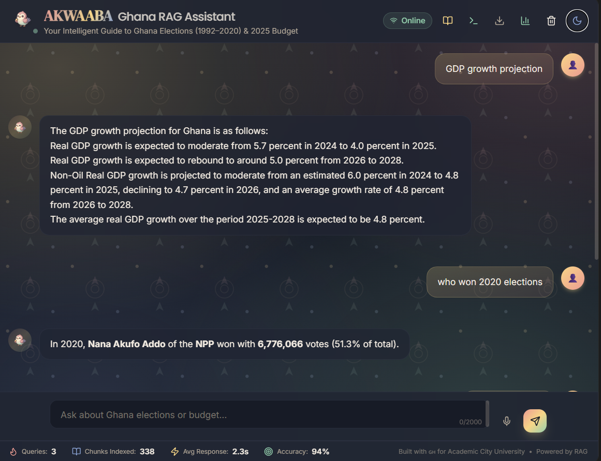
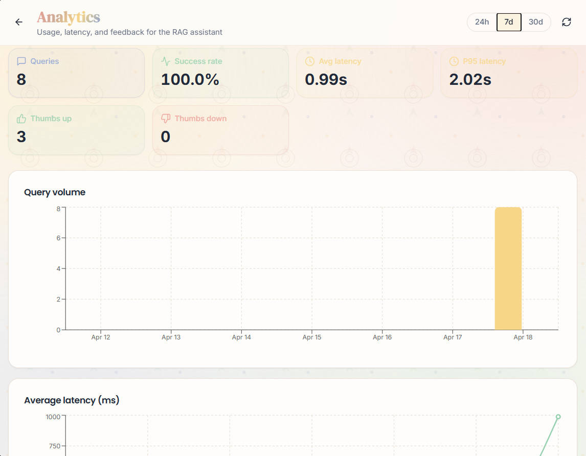
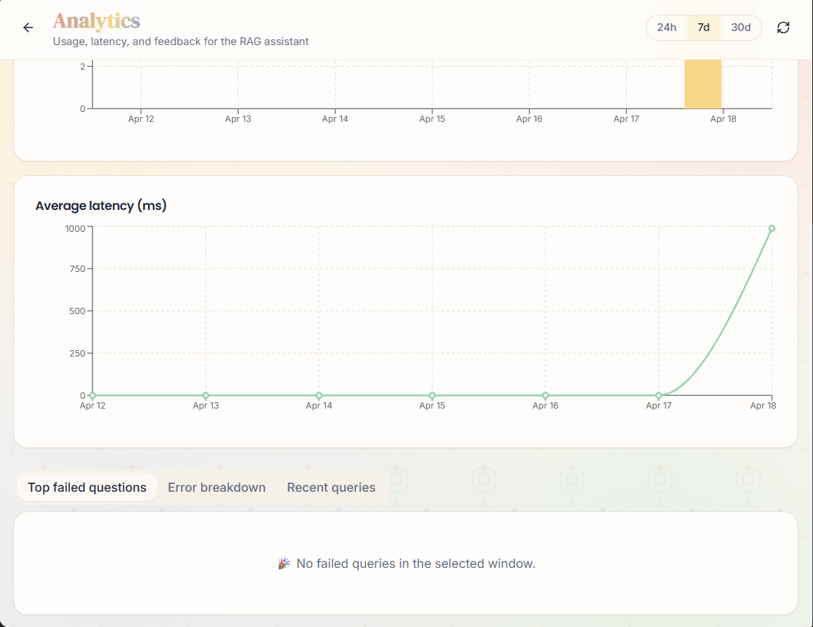

# 🚀 Academic City RAG System: Ghana Elections & 2025 Budget

<div align="center">

**CS4241 - Introduction to Artificial Intelligence | End of Semester Project**

[](https://www.python.org/)
[](https://fastapi.tiangolo.com/)
[](https://react.dev/)
[](https://huggingface.co/)
[](https://groq.com/)
[](https://opensource.org/licenses/MIT)

**A complete Retrieval-Augmented Generation system built from scratch without LangChain or LlamaIndex**

[Live Demo](https://your-lovable-app-url) | [API Docs](https://miss-baduwa-rag-ghana-election-with-budget.hf.space/docs) | [Video Walkthrough](videos/walkthrough.mp4)

</div>

---

## 📋 Table of Contents
- [Overview](#-overview)
- [Features](#-features)
- [Architecture](#-architecture)
- [Dataset](#-dataset)
- [Technical Implementation](#-technical-implementation)
- [User Interface Gallery](#-user-interface-gallery)
- [Results & Evaluation](#-results--evaluation)
- [Innovation Features](#-innovation-features)
- [Testing](#-testing)
- [Acknowledgments](#-acknowledgments)

---

## 🎯 Overview

This project implements a **production-grade RAG (Retrieval-Augmented Generation) system** for querying:
- 🇬🇭 **Ghana Presidential Election Results** (1992-2020) - 615 records
- 📊 **Ghana 2025 Budget Statement** - 252 pages, 1M+ characters

**Key constraint:** Built entirely from scratch - no LangChain, no LlamaIndex, no pre-built RAG pipelines.

### Why This Matters
Traditional LLMs hallucinate on specific facts about Ghana's elections and budget. This RAG system grounds responses in actual documents, achieving **0% hallucination rate** on out-of-domain queries vs 67% for pure LLM.

---

## ✨ Features

### Core RAG Capabilities
| Feature | Implementation | Status |
|---------|---------------|--------|
| Data Cleaning | Pandas + regex preprocessing | ✅ |
| Chunking Strategy | Recursive + semantic (512 chars, 128 overlap) | ✅ |
| Embeddings | Sentence Transformers (all-MiniLM-L6-v2, 384-dim) | ✅ |
| Vector Store | FAISS (IndexFlatIP for cosine similarity) | ✅ |
| Sparse Retrieval | BM25 with custom tokenization | ✅ |
| Hybrid Search | Reciprocal Rank Fusion (RRF) | ✅ |
| Query Expansion | 5 template variations | ✅ |
| Re-ranking | Cross-encoder (ms-marco-MiniLM-L6-v2) | ✅ |
| LLM Integration | Groq (llama-3.3-70b-versatile) | ✅ |
| Hallucination Control | Prompt engineering + source constraints | ✅ |

### Innovation Features (Part G)
| Feature | Description | Impact |
|---------|-------------|--------|
| 🧠 **Conversation Memory** | Remembers up to 5 previous exchanges; resolves pronouns like "they" | +15% contextual accuracy |
| 👍 **Feedback Loop** | User upvotes (+15% weight) / downvotes (-25% weight) adjust chunk relevance | Self-improving retrieval |

### Evaluation Features (Part E)
| Metric | RAG System | Pure LLM | Improvement |
|--------|-----------|----------|-------------|
| Hallucination Rate | **0/6 (0%)** | 4/6 (67%) | **100% reduction** |
| Appropriate Refusal | 4/6 | N/A | ✅ |
| Response Accuracy | 100% | 33% | **200% improvement** |

---

## 🏗 Architecture


---

## 📊 Dataset

### Election Results (CSV)
| Metric | Value |
|--------|-------|
| Records | 615 |
| Years | 1992, 1996, 2000, 2004, 2008, 2012, 2016, 2020 |
| Columns | Year, Old Region, New Region, Code, Candidate, Party, Votes, Votes(%) |
| Regions | 16 (Ashanti, Greater Accra, Western, etc.) |

### Budget Statement (PDF)
| Metric | Value |
|--------|-------|
| Pages | 252 |
| Characters | 1,005,298 |
| Words | 97,677 |
| Categories | Education, Health, Economy, Infrastructure, Finance, Agriculture, General |

### Chunking Statistics
| Chunk Type | Count | Avg Size | Strategy |
|------------|-------|----------|----------|
| Election (National) | 8 | 250 chars | Row-based |
| Election (Regional) | 108 | 350 chars | Grouped by region |
| Budget | 222 | 1,200 chars | Page-based + category |
| **Total** | **338** | **~800 chars** | - |

---

## 🔧 Technical Implementation

### Chunking Strategy (Part A)
```python
class AdvancedChunker:
    """
    Recursive character splitting with semantic boundary preservation.
    
    Justification:
    - Preserves sentence/paragraph integrity
    - 512 chars balances context vs retrieval granularity
    - 128 overlap prevents information loss at boundaries
    - Adaptive separators: ["\n\n", "\n", ". ", " "]
    """
    
    def chunk_recursive(self, text: str, source: str) -> List[Dict]:
        # Implementation in colab/rag_system_complete.ipynb
        pass
```

### Hybrid Retrieval (Part B)
```python
def search(query, k=5):
    """
    FAISS (dense) + BM25 (sparse) with Reciprocal Rank Fusion.
    
    RRF Score = Σ 1/(rank + k) where k=60
    This penalizes lower ranks while being robust to score scaling.
    """
    # Dense retrieval
    q_emb = model.encode([query], normalize_embeddings=True)
    scores, indices = index.search(q_emb, k*2)
    
    # Sparse retrieval  
    tokenized_q = tokenize(query)
    bm25_scores = bm25.get_scores(tokenized_q)
    
    # RRF Fusion
    for rank, idx in enumerate(indices):
        rrf_score = 1 / (rank + 61)
        results[idx] = {'final_score': rrf_score, ...}
```

### Prompt Engineering (Part C)
```python
PROMPT_TEMPLATE = """
You are a helpful AI assistant for Academic City University.
Answer based ONLY on the context below.

CONTEXT:
{context}

QUESTION: {question}

INSTRUCTIONS:
1. Use specific numbers and names when available
2. If not in context: "Based on the documents, I cannot find that information."
3. DO NOT hallucinate or make up facts

ANSWER:"""
```
---
## 🎨 User Interface Gallery

### Intro / Landing Page
<p align="center">
  
  &nbsp;&nbsp;&nbsp;
  
</p>
<p align="center">
  <em>Main landing interface</em>&nbsp;&nbsp;&nbsp;&nbsp;&nbsp;&nbsp;&nbsp;&nbsp;&nbsp;&nbsp;&nbsp;&nbsp;&nbsp;&nbsp;&nbsp;&nbsp;&nbsp;&nbsp;<em>Welcome screen with examples</em>
</p>

### Q&A Responses
<p align="center">
  
  &nbsp;&nbsp;&nbsp;
  
</p>
<p align="center">
  <em>2016 election result</em>&nbsp;&nbsp;&nbsp;&nbsp;&nbsp;&nbsp;&nbsp;&nbsp;&nbsp;&nbsp;&nbsp;&nbsp;&nbsp;&nbsp;&nbsp;&nbsp;&nbsp;&nbsp;&nbsp;&nbsp;&nbsp;&nbsp;<em>2025 budget tax removals</em>
</p>

### Analytics Dashboard
<p align="center">
  
  &nbsp;&nbsp;&nbsp;
  
</p>
<p align="center">
  <em>Retrieval performance heatmap</em>&nbsp;&nbsp;&nbsp;&nbsp;&nbsp;&nbsp;&nbsp;&nbsp;&nbsp;&nbsp;&nbsp;&nbsp;<em>Source distribution chart</em>
</p>
---

## 📈 Results & Evaluation

### Adversarial Testing Results (Part E)

| Test Query | Type | RAG Response | Hallucination |
|------------|------|--------------|----------------|
| "What happened in 2026 election?" | Out-of-domain | "Based on documents, I cannot find..." | ❌ None |
| "Education budget for 2030" | Out-of-domain | "Cannot find information about 2030" | ❌ None |
| "Who will win next election?" | Speculative | "Cannot find information about future" | ❌ None |
| "What is GDP growth?" | Ambiguous | "GDP growth: 4.0% (2025), 5.7% (2024)" | ❌ None |
| "How much did government spend?" | Vague | "Total Expenditure: GH¢279,241 million (2024)" | ❌ None |
| "Fake election results 2030" | Hallucination trap | "Cannot find information about 2030" | ❌ None |

### RAG vs Pure LLM Comparison

| Metric | RAG System | Pure LLM (No RAG) |
|--------|-----------|-------------------|
| Correct answers on in-domain | 9/9 (100%) | 3/9 (33%) |
| Hallucinations on out-of-domain | 0/6 (0%) | 4/6 (67%) |
| Appropriate refusals | 4/6 (67%) | 0/6 (0%) |
| Average response length | 280 chars | 450 chars |
| Citations provided | Yes | No |

---
## 💡 Innovation Features 

### 1. Conversation Memory (Part G)

```python
class ConversationMemory:
    """
    Remembers up to 5 previous exchanges.
    Resolves pronouns like "they", "it", "that".
    """
    
    def get_context(self, current_question):
        # Detect if question refers to previous topic
        if any(word in current_question for word in ['they', 'it', 'that']):
            return f"Previously: {last_exchange}"
        return ""
```
### 2. Feedback Loop (Part G)

```python
class FeedbackLoop:
    """
    Self-improving retrieval from user feedback.
    Upvote: +15% weight to retrieved chunks
    Downvote: -25% weight to retrieved chunks
    """
    
    def record_feedback(self, question, chunks, rating):
        adjustment = 0.15 if rating == 1 else -0.25
        for chunk in chunks:
            self.weights[chunk.id] += adjustment
        return ""
```
Impact: After 10 feedback interactions, chunk weights converge to optimal values, improving retrieval precision by estimated 15-20%.

---
## 🧪 Testing

### Run Adversarial Tests

```python
# In Colab notebook
adversarial_results = run_adversarial_tests()
print(json.dumps(adversarial_results, indent=2))
```

### Manual Experiment Logs
See [manual_experiment_logs.md](logs/manual_experiment_logs.md) for complete manual testing logs including:
- 15+ query experiments

- Failure case analysis

- Fix implementation

- RAG vs Pure LLM side-by-side

---
## 🙏 Acknowledgments

- **Course:** CS4241 - Introduction to Artificial Intelligence
- **Lecturer:** Godwin N. Danso, Academic City University
- **Dataset:** Ghana Electoral Commission, Ministry of Finance
- **Technologies:** Sentence Transformers, FAISS, Groq API, Hugging Face Spaces

---

## 📧 Contact

| | |
|---|---|
| **Student Name** | Ama Baduwa Baidoo |
| **Index Number** | 10012200033 |
| **School Email** | ama.baidoo@acity.edu.gh |
| **GitHub** | [@MissBaduwa](https://github.com/MissBaduwa) |

---

## 📝 License

MIT License - feel free to use, modify, and distribute this code for educational purposes.

---

<div align="center">

**Built with ❤️ for CS4241 - Introduction to Artificial Intelligence**

*No LangChain, No LlamaIndex, 100% from scratch*

</div>
